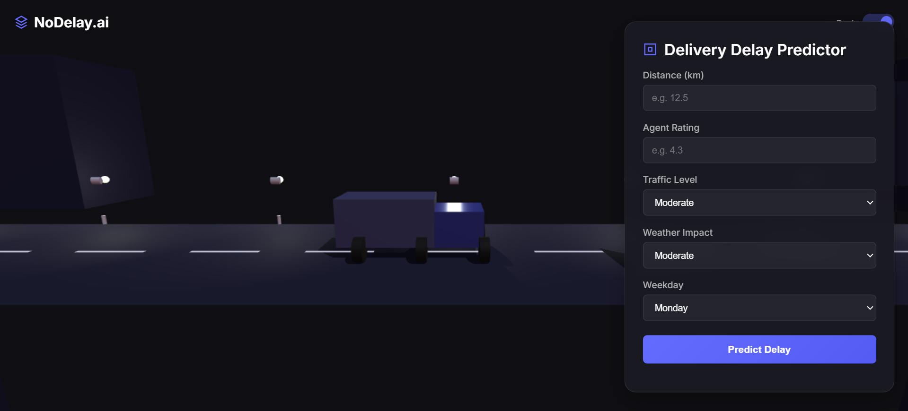

# 🚛 nodelay.ai — Real-Time Delivery Delay Predictor  

`nodelay.ai` is a blazing-fast, ML-powered delivery delay prediction system that tells you **exactly** when your delivery is going to screw up — before it even thinks about it.  
Built with **FastAPI**, **Three.js**, and a custom-trained ML model, this isn’t just a logistics tool.  
It’s your oracle in a chaotic world of traffic jams and thunderstorms.

> 🔴 **Live Now:** [https://no-delay-beta.vercel.app](https://no-delay-beta.vercel.app/)

---

## 🧠 Tech Stack

| Tech           | Why it’s used                                         |
|----------------|------------------------------------------------------|
| FastAPI        | Ultra-speed backend API for prediction               |
| Scikit-learn   | Machine Learning model training & inference          |
| Three.js       | 3D magic — animated truck                            |
| Vercel        | Frontend hosting in one click                        |
| Render         | Backend hosting made easy                            |

---

## 🛠 Features

- 🔮 Predicts **delivery delays** using an intelligent ML model
- 📈 Returns probability of delay
- 🌦️ Considers weather, traffic, delivery speed, agent stats, and more
- 🚛 Gorgeous **3D truck UI** 
- 🧠 Powered by trained machine learning model
- 🌐 Deployed and production-ready

---

